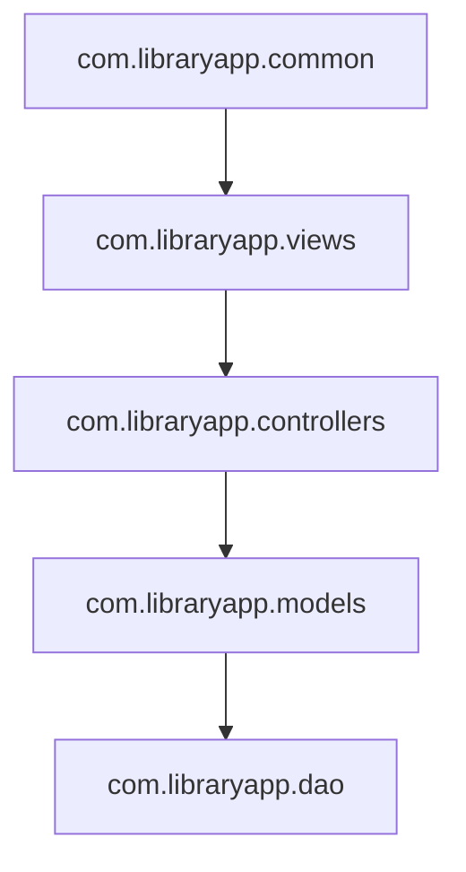
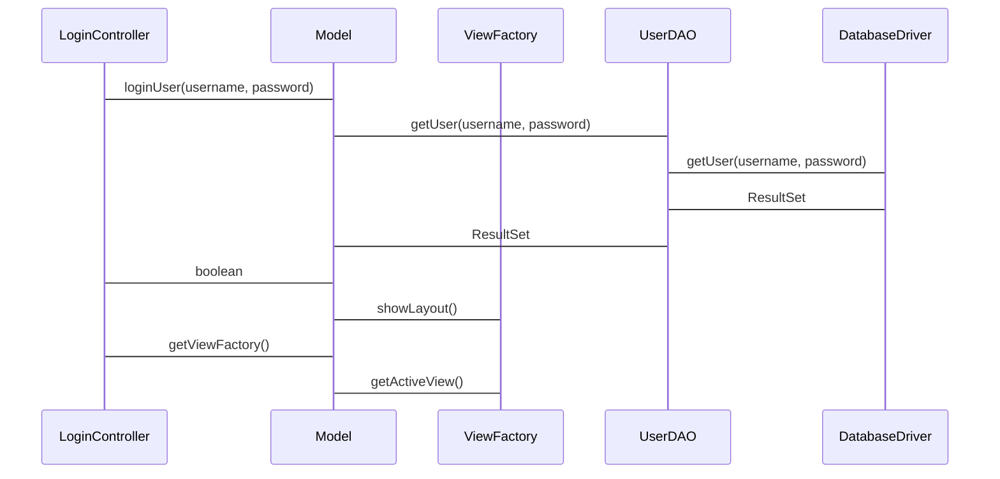
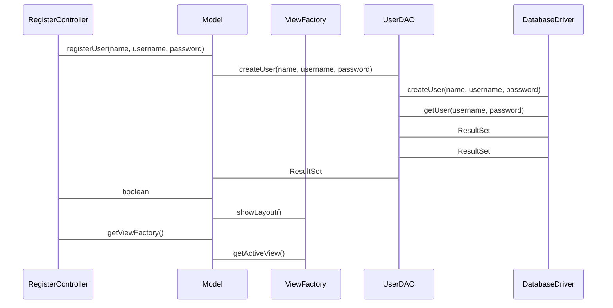

# Arkkitehtuurikuvaus
## Rakenne
Sovelluksen rakenne noudattaa kerrosarkkitehtuuria ja on pakkausrakenteeltaan seuraavanlainen

Pakkaus common sisältää sovelluksen jaettuja asetuksia. Views pakkauksessa on JavaFX:llä toteutetun käyttöliittymän koodia ja controllers pakkausessa on käyttöliittymän ohjaamiseseta vastaava sovelluslogiikka. Models pakkausessa vastataan sovelluksen tiedon rakenteesta ja käsittelystä ja pakkaus dao sisältää tietokannan yhteydestä, alustuksesta ja tiedon tallennuksesta vastaava koodia.

## Käyttöliittymä

Käyttöliittymässä on seitsemän näkymää:
* käyttäjän kirjautuminen
* uuden käyttäjän rekiströinti
* etusivu
* kirjojen lista
* uuden kirjan luominen
* kirjailijoiden lista
* uuden kirjailijan luominen

## Päätoiminallisuudet

### Käyttäjän kirjautuminen

Käyttöliittymässä käyttäjän syötettyä syötekenttään käyttäjätunnusta sekä salasanaa ja Login painiketta painettua LoginController luokkassa tapahtumakäsittelijä kutsuu loginUser metodia Model singleton-luokasta ja välittää käyttäjän syöttämää käyttäjätunnusta sekä salasanaa. Model luokka kutsuu UserDAO luokan getUser metodia välittäen tietokantalauseelle parametreiksi käyttäjätunnuksen sekä salasanan. UserDAO luokka kutsuu getUser metodia, joka tekee yhteyden DatabaseDriver luokkaan ja ajaa tietokantalausetta. DatabaseDriver luokka palauttaa ResultSet-objektin, joka sisältää tietokantakyselyn tulosta. UserDAO luokka edelleen välittää ResultSet-objektin Model luokalle, joka palauttaa boolean arvon riippuen kirjautumisen onnistumisesta tai epäonnistumisesta. Jos sisäänkirjautuminen onnistui, LoginController-luokka kutsuu ViewFactory-luokan showLayout-metodia näyttääkseen sovelluksen pääasettelun.

### Käyttäjän rekisteröinti

Käyttäjän rekisteröinti toiminto seuraa samaa toimintalogiikkaa, kuin käyttäjän kirjautuminen. Käyttäjän syötettyä syötekenttään nimi, käyttäjätunnus sekä salasana ja painettua Register painiketta RegisterController luokassa tapahtumakäsittelijä kutsuu registerUser metodia Model singleton-luokasta ja välittää käyttäjän syöttämää nimeä, käyttäjätunnusta sekä salasanaa. Model luokka kutsuu UserDAO luokan createUser metodia ja välittää tietokantalauseelle parametreiksi, nimen, käyttäjätunnuksen sekä salasanan. UserDAO luokka kutsuu createUser metodia, jonka sisällä kutsutaan getUser metodia ja tekee yhteyden DatabaseDriver luokkaan sekä ajaa tietokantalausetta. DatabaseDriver luokka palauttaa ResultSet-objektin, joka sisältää tietokantakyselyn tulosta. Jos ResultSet-objekti ei sisällä tietoa tämä tarkoittaa, että tietokannasta ei löydy käyttäjän syöttämää käyttäjätunnusta, jonka jälkeen tehdään toinen yhteys DatabaseDriver luokkaan ja ajetaan tietokannan lisäyslausetta, josta palautetaan ResultSet-objekti Model luokalle. Model luokan registerUser palauttaa boolean totuusarvon, jos käyttäjätunnus lisättiin onnistuneesti ja RegisterController-luokka kutsuu ViewFactory-luokan showLayout-metodia näyttääkseen sovelluksen pääasettelun.